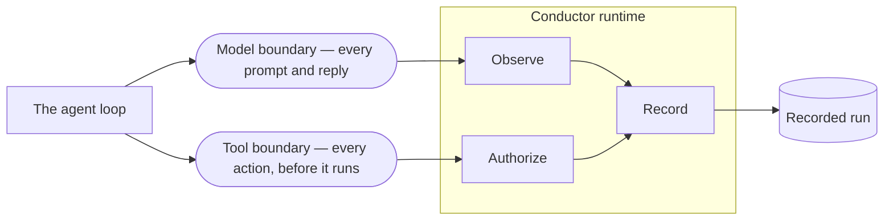
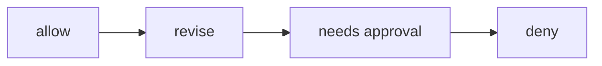
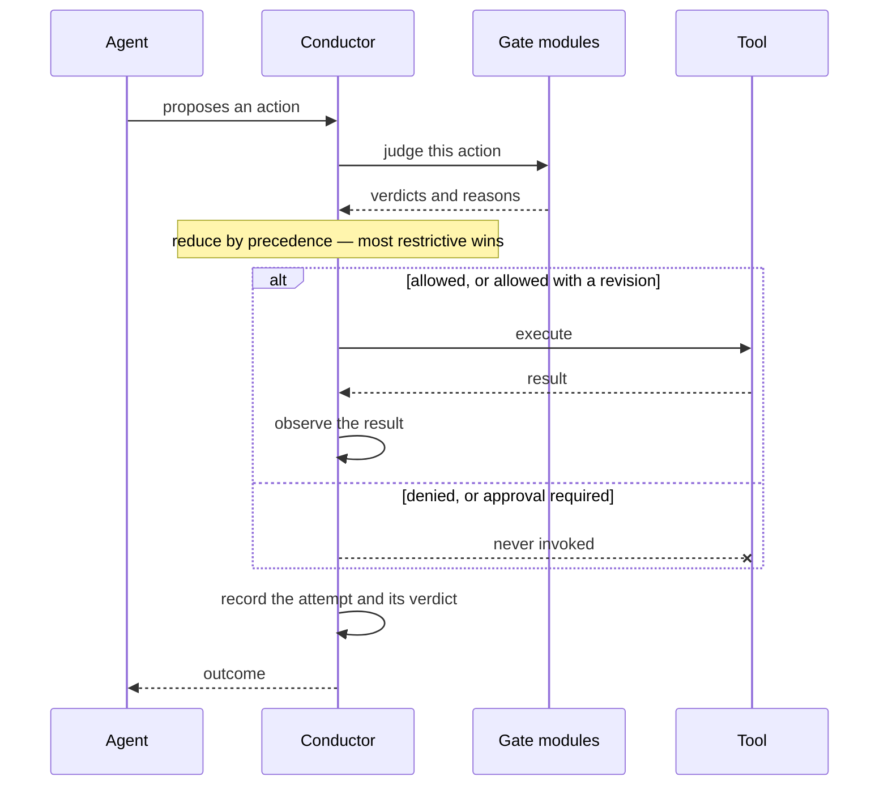
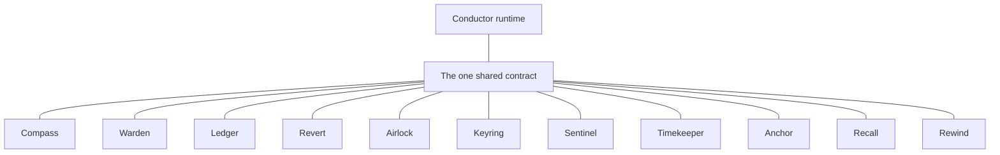

# Architecture

Every boundary the agent crosses gets watched, judged, recorded, and can be replayed.

This explains how it's put together and how it behaves. No source code, no implementation detail.

---

## Two boundaries

An agent calls a model, and it calls a tool. That's it. Everything else is scaffolding around
those two moments, and pretty much every production failure happens at one of them. Bad reasoning
comes in at the model call. Bad consequences go out at the tool call.

Conductor wraps both. That's the whole idea, and it's why the layer stays small enough to trust.

### The model boundary

Every prompt going out and every reply coming back.

Nothing gets blocked here, only watched. A reply is just information, it hasn't done anything yet,
so stopping it would be jumping the gun. What's useful is flagging it, so the gate further down
has something to work with. Grounding, staleness, drift, and memory all start as notes taken here.

### The tool boundary

Every action the agent wants to take, checked before it runs.

This is the only place anything can be stopped, and that's deliberate. One narrow chokepoint is
easier to reason about than checks scattered everywhere. If an action doesn't pass here, the tool
never gets called at all.

---

## Observe

After each event, the observer modules look at what happened and can emit Signals: a stale fact, a
drift warning, a quarantined tool result, a memory stored, a grounding concern.

Observers take notes. They never block.

That's on purpose. If an observer could halt a run, every observation becomes a possible outage
and people switch them off. Because they can only annotate, a wrong observation costs you some
noise instead of downtime, so you can leave them all on.

An observer that blows up turns into an error Signal and the run keeps going.

## Authorize

Before an action runs, each gate module judges it and returns one verdict. Those get reduced to a
single answer by fixed precedence.

Most restrictive wins. One deny kills the action no matter how many modules were fine with it. A
revision only gets applied if nothing denied and nothing asked for approval.

Every module's reasons get carried through, not just the winner's, so when you read a refusal you
see all of why it was refused instead of the first thing that tripped.

Two things are guaranteed here. The check finishes before anything happens, so on a deny the tool
function is never called. And the refusal still gets written down with its verdict and reasons,
so nothing vanishes just because it was stopped.

## Record

As the run goes, the runtime writes down every crossing: events, signals, decisions, and the
reasons behind them, all into one recording.

That's recording, not logging. A log is a description you read afterwards. A recording is the run
itself, complete enough to run again.

## Replay

You can take a recording, reproduce it, and diff it against the original.

This is the part that isn't observability. Observability tells you what the agent did. Replay lets
you run exactly what it did again and walk the decision path, same events, same signals, same
verdicts, same order.

It works because the runtime hands out the clock and the IDs instead of reading them from the
environment. No wall-clock time and no randomness get into the recording, so two recordings of the
same scenario come out byte-identical.

The recording is evidence, never input. It never feeds back into decisions, so replaying a run
can't change what that run would have decided.

---

## How it's put together

Hub and spokes.

The eleven modules don't know about each other. Only the runtime knows all eleven. Every module
talks to the contract and never to a sibling.

If you're maintaining this, that means you can change, swap, or delete any module without touching
the other ten, and the code that wires them together lives in one place. There's no dependency
graph to untangle, just a hub and eleven spokes.

## When something breaks

It's a safety layer, so its own failures got designed first.

| What breaks | What happens |
|---|---|
| A gate throws | Counts as a deny. The tool doesn't run. |
| A gate returns something unrecognizable | Counts as a deny. The tool doesn't run. |
| An observer throws | Turns into an error Signal. The run continues. |

A broken module can't take down the runtime, and it can't quietly leave a gate open. If a safety
check breaks, it breaks toward saying no.

That wasn't assumed, it was tested by deliberately breaking things. See [TESTING.md](TESTING.md).

---

## What it isn't

It's not a model, an agent framework, or an orchestrator deciding what the agent should do next.
It has no opinion about the agent's logic.

It's not an observability product. It records so you can re-run, not so you can draw charts.

It's not a hosted service. There's nothing to send data to.

It's the layer underneath, making whatever the agent decided visible, enforceable, and
reproducible.
