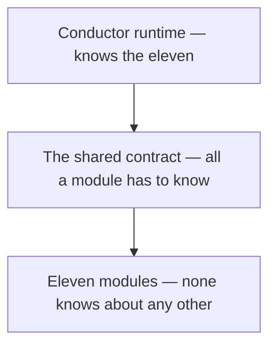

# Runtime

One runtime. Eleven modules. One shared contract.

This is the concepts, not the interfaces. No method signatures, config formats, or data
structures.

---

## One runtime

Conductor wraps an agent loop you already have. Your agent keeps its own model and its own tools,
and Conductor goes around them.

It does three things:

1. Turns crossings into events. Every model call and tool call becomes something the modules can
   act on.
2. Runs the two phases. Watch what happened, judge what's about to happen.
3. Records the run. Events, signals, decisions, and reasons, into one reproducible recording.

That's all it does. It doesn't decide what the agent should do, manage prompts, schedule work, or
have any opinion about the agent's logic. If it made those decisions too it'd be a framework you'd
have to adopt wholesale. Because it makes none of them, you can bolt it onto an agent that already
exists.

## Eleven modules

Eleven modules take part. Each handles one failure and runs on its own. See
[MODULES.md](MODULES.md).

A module joins whichever phase suits it. Some watch, some judge, some do both, one hooks the
runtime. If a module doesn't take part in a phase, it just gets skipped, there's no special case
to configure around.

## One shared contract

Every module speaks the same small contract. That's the only thing a module has to know.

The value is in what it removes. Because there's exactly one, adding a module is wiring rather
than integration work. No adapter per pair, no arguing about formats, no growth in coupling as the
roster grows. Eleven modules against one contract is eleven relationships. Eleven modules wiring
into each other directly would be fifty-five.

Keeping the contract small is what keeps it stable. A big contract has to change every time a
module needs something. A small one doesn't, which is why modules written against it don't break
when the roster changes around them.

## Composition, not rewrites

Modules don't know about each other. Only the runtime knows all eleven. Every module talks to the
contract, never to a sibling.

What that gets you:

- Change, swap, or delete any module without touching the other ten. No dependency graph to trace
  first.
- The wiring lives in one place. Understanding how the eleven fit together is reading one thing,
  not eleven.
- Adopt gradually. Turn modules on as you trust them instead of accepting all eleven judgments on
  day one.
- The roster isn't fixed. A twelfth module is a twelfth spoke, not a redesign.

Build the same features into an agent framework instead and none of that holds. Removing one
behavior means understanding all of them.

## Isolation

Isolation is enforced by the runtime, not a convention modules are trusted to follow.

| What breaks | What happens |
|---|---|
| A gate throws | Counts as a deny. The tool doesn't run. |
| A gate returns something unrecognizable | Counts as a deny. The tool doesn't run. |
| An observer throws | Turns into an error Signal. The run continues. |

Two things follow, and they're the ones that matter for a safety layer.

A broken module can't take down the runtime. The blast radius of a module failing is that module.

A broken module can't quietly leave a gate open. A gate that fails becomes a refusal, never an
absence. That's the difference between a safety layer and a monitoring layer: a monitor that
breaks stops reporting, which you can live with, while a gate that broke open would stop enforcing
while still looking fine.

Per-run state is held per module and the runtime never touches it, so one module can't corrupt
another's view of the run even by accident.

## Signals

Observers emit Signals: a stale fact, drift, a quarantined tool result, a memory stored, an error
from a module.

Signals annotate the run. They don't stop it. An observer's finding doesn't become an enforcement
decision on its own, it becomes part of the record that gates read from and a human reviews later.

That split is what makes both halves usable. Since a Signal can't halt a run, you can leave every
observer on and the cost of a wrong one is noise rather than an outage. And since gates are the
only things that can stop an action, the enforcement surface stays small enough to reason about.

Signals pile up across the whole run instead of being consumed where they're emitted. That's what
makes run-level analysis possible, since drift only shows up in the shape of a sequence and never
in a single step of it.

## Deterministic replay

Every crossing gets written into one recording as the run goes, and you can replay and diff it.

Determinism is built in rather than arranged at test time. The runtime supplies time and ID
generation instead of reading them from the environment, so no wall-clock value and no randomness
land in the recording. There's no test scaffolding and no special mode to switch on. It's
deterministic when you use it normally, which is the only way the property is worth anything.

Verified, not asserted: the same scenario recorded three times produced one hash across all three,
and replaying against the original reported no divergences.

The recording is evidence, never input. It never feeds back into decisions, so replaying a run
can't change what that run would have decided. A recording that could influence a verdict wouldn't
be a record of the run, it'd be part of it.

The difference from logging is the whole point. A log is a description written for a human to read
later. A recording is the run, complete enough to execute again, which is what incident review,
audits, and real debugging all need and none of them get from a log.

## Three ways in

All three drive the same runtime, and none is a cut-down version of another.

Library API, for wrapping an agent loop inside an app you already have.

CLI, for running, recording, replaying, and diffing without writing an integration first. Quickest
way to point it at real work.

MCP server, so an MCP host can use it with no custom glue.

## What it needs

| Property | Value |
|---|---|
| External dependencies | 0 |
| Network | none, no sockets, no outbound calls |
| Credentials | none |
| Build step | none |
| Dynamic code execution | none |
| Filesystem writes | only paths you hand it |
| Runtime | Node.js 20 or newer |
| Platform | Windows |

Zero dependencies is a durability property as much as a security one. There's no supply chain to
audit, nothing upstream that can break it, and no vendor API that can shift underneath it, so a
frozen version stays usable for years. That isn't true of most software in this category.

## One known gap

A runtime built with no gate modules at all allows every action, and says so with an informational
reason.

For a safety product it should warn or refuse to start. It's recorded as an open item rather than
left for someone to trip over. See [CERTIFICATION.md](CERTIFICATION.md).
