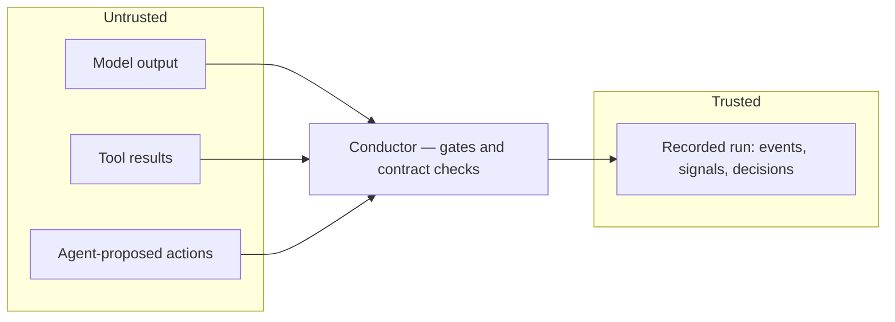

# Security

Conductor is a security-relevant layer, so here's how it thinks about security.

This covers what it defends against and the reasoning behind it. It doesn't cover how any of it is
implemented.

---

## The starting assumption

Conductor treats the agent as untrusted.

The model might be manipulated, confused, or just wrong, and the code around it shouldn't assume
otherwise. So every check sits *between* the agent and the world, never inside the agent and never
written as an instruction asking it to behave.

That's the difference between a guardrail and a control. An instruction in a prompt is a request
the agent can misread, be talked out of, or satisfy in a way you didn't mean. A control at a
boundary holds regardless of what the agent thinks it's doing.

## Trust boundaries

Anything coming in from the left is treated as hostile until it clears a gate or a contract check.
Anything on the right is evidence, not input. The recording never feeds back into decisions.

---

## Policy

Policy gets applied to actions at the tool boundary instead of described to the agent in a prompt.

It covers what the agent may do, what it may spend, and what content may reach a tool. That last
one is the prompt-injection surface: text that came in through a model reply or a tool result,
carrying an instruction, heading for something with real consequences. Screening happens at the
point of consequence, because that's the only place where where the instruction came from stops
mattering.

Budget is enforcement, not reporting. A run that goes over its allowance gets stopped, not noted
afterwards.

## Authorization

Every proposed action is checked before it runs.

| Property | Guarantee |
|---|---|
| Ordering | The check finishes before the side effect. A denied action never reaches the tool. |
| Precedence | Most restrictive wins. One deny denies, no matter how many modules allowed. |
| Legibility | Reasons from every module are carried together, so a refusal shows all of its causes. |
| Auditability | A blocked attempt is recorded with its verdict. Refusals are evidence, not gaps. |

The check is scoped to the mission as well as to policy, so work that's adjacent to the objective
but outside it gets refused instead of quietly done.

## Failing closed

For a safety layer, what matters most is what happens when the safety layer itself breaks.

| What was done to it | What happened |
|---|---|
| Made a gate throw | Denied. The tool never ran. |
| Made a gate return nonsense | Denied. The tool never ran. |
| One module allowed, another denied | Deny won. The tool never ran. |
| Made an observer throw | Error Signal emitted. Run continued. No crash. |

A gate that fails becomes a refusal, never an absence. A monitor that breaks stops reporting,
which you can live with. A gate that broke open would stop enforcing while still looking like it
worked, which you can't.

That was confirmed by deliberately breaking things and watching what happened, not by reasoning
about it. See [TESTING.md](TESTING.md).

## Credentials

Credentials are issued just in time, scoped to the task, and expiring.

The problem this solves is structural rather than exotic. Agents usually get handed long-lived
keys far broader than any one task needs, because setting up a key per task is inconvenient. After
that, every other failure is amplified by whatever that key can reach.

Short, narrow leases bound the damage from everything else in the system, whether the cause was an
attack, a manipulated model, or an ordinary bug.

## Egress

Sensitive values get fingerprinted where they come in, followed as they move around, and inspected
at any outbound sink before anything leaves.

The naive exfiltration path is plain text, and any filter catches that. The path that beats most
controls is encoded: wrapped, compressed, or nested until pattern matching doesn't recognize what
it's looking at. Conductor decodes and rescans nested content rather than taking it at face value,
and reports the path it followed to find the data. Canary tokens get caught at every sink,
including inside decoded layers.

Decoding is explicitly bounded, because a scanner that recurses without limit is a
denial-of-service target against itself.

That bound was tested rather than assumed. The scanner was fuzzed with 200,000 generated inputs
across eleven adversarial generators: deeply nested and mixed encodings, truncated and corrupted
payloads, compression bombs, single tokens of 200,000 characters, and hostile non-string inputs.
No crash, no unbounded run, no contract violation. Slowest single call was 65 ms and memory stayed
bounded. Numbers in [CERTIFICATION.md](CERTIFICATION.md).

## Tool results

Tool output gets validated against what that tool is supposed to return, and anything that fails
is quarantined before it re-enters the agent's context.

This is the direction most agent stacks leave wide open. Controls go on what the agent sends out,
and nothing checks what comes back, even though the agent has no way to tell a sound result from a
malformed or hostile one. It'll reason over whatever it gets, and the corruption spreads through
every step after that.

## Drift

The run's trajectory gets analyzed against its objective, and drift is reported with its kind and
severity.

Some failures are invisible to every per-action check, mission-scope gate included. No single step
is wrong, a series of small reasonable substitutions just ends somewhere the objective never
pointed. That failure lives in the shape of the sequence, so only something looking at the whole
run can catch it.

## Auditability

Every crossing is recorded as the run goes: events, signals, decisions, and the reasons behind
them, into one recording you can replay and diff.

Replay reproduces the run identically, same events, same signals, same verdicts, same order. The
same scenario recorded three times produced one hash across all three.

The difference from logging is what makes this a security property. A log is a description of what
happened, written for a human. A recording is the run, complete enough to run again, which is what
incident review and audits need and neither gets from a log.

The recording is evidence, never input. Replaying a run can't change what that run would have
decided.

---

## Attack surface

Deliberately small.

| Property | Value |
|---|---|
| Network | No sockets opened. No outbound calls. |
| External dependencies | Zero, so no supply chain to audit |
| Platform facilities | 8 standard Node.js built-ins |
| Credentials required | None. No API keys, tokens, or accounts. |
| Filesystem writes | Only paths you hand it |
| Dynamic code execution | None |

Running offline is a security property on its own. Nothing about a run gets transmitted anywhere,
which is what makes this usable in air-gapped and regulated environments where routing agent
traffic through a hosted service isn't allowed.

## Randomness that has to stay random

Some randomness in the product is required and must not be made deterministic. A predictable
canary token isn't a tripwire. A fixed initialization vector is a serious cryptographic defect.
Lease identifiers shouldn't be guessable.

That randomness is confined to values that never reach the recording. Determinism covers the
recorded run and the safety verdicts, both verified stable. The two don't conflict.

---

## Known gaps

1. No third-party security audit. The security-critical modules have been checked internally
   through the test suite, adversarial failure testing, structural analysis, and fuzzing, but no
   independent firm has reviewed them. Internal checking isn't a substitute, and for a security
   product that's a real gap. A licensee should expect to commission one.
2. Open by default with no gates. A runtime built with no gate modules allows every action. Only
   reachable through misconfiguration and the integration instructions are explicit, but a safety
   product should warn or refuse to start rather than run quietly permissive.
3. No per-module threat model. This document covers the product. Each module would benefit from
   its own.
4. Fuzzing covers the decode scanner only. The product's other input validators haven't been
   fuzzed.

Tracked in [CERTIFICATION.md](CERTIFICATION.md).

## Reporting something

This repo is documentation only, so there's no source here to report a vulnerability in.

If you think something described here is unsound, or you've spotted a weakness in the security
model as documented, use the contact in [ACQUISITION.md](ACQUISITION.md). Please don't open a
public issue for a suspected vulnerability.
